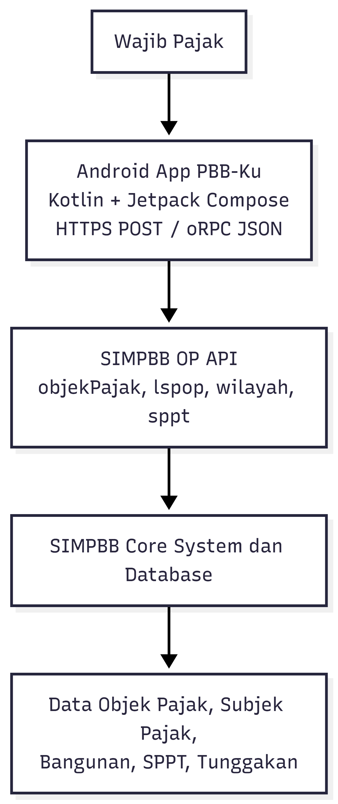
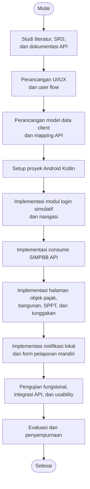

# SOFTWARE REQUIREMENTS SPECIFICATION (SRS)
# Proyek 2 - PBB-Ku: Aplikasi Portal Wajib Pajak

**Standar:** IEEE 830-1998

## Atribut Dokumen

| Atribut | Detail |
|---|---|
| Nama Sistem | PBBku |
| Klien | Bapenda |
| Versi Dokumen | 1.0 |
| Tanggal | 30 April 2026 |
| Standar Acuan | IEEE Std 830-1998 |

## Riwayat Revisi

| Versi | Tanggal | Penulis | Keterangan |
|---|---|---|---|
| 1.0 | 30/04/2026 | Tim Pengembang | Draft awal SRS |

## Daftar Isi

1. [Pendahuluan](#10-pendahuluan)
2. [Deskripsi Keseluruhan](#20-deskripsi-keseluruhan)
3. [Kebutuhan Fungsional](#30-kebutuhan-fungsional)
4. [Kebutuhan Non-Fungsional](#40-kebutuhan-non-fungsional)
5. [Kebutuhan Antarmuka Eksternal](#50-kebutuhan-antarmuka-eksternal)
6. [Rancangan Implementasi dan Pengujian](#60-rancangan-implementasi-dan-pengujian)
7. [Jadwal Kegiatan](#70-jadwal-kegiatan)
8. [Glosarium](#glosarium)
9. [Referensi](#referensi)
10. [Lampiran](#lampiran)

---

# 1.0 Pendahuluan

## 1.1 Tujuan Dokumen

Dokumen *Software Requirements Specification* (SRS) ini disusun untuk mendefinisikan kebutuhan perangkat lunak PBB-Ku secara lengkap, terstruktur, dan dapat diuji. Dokumen ini menjadi acuan bagi tim pengembang dalam merancang, mengimplementasikan, menguji, dan mendemonstrasikan aplikasi mobile PBB-Ku. Struktur dokumen mengikuti format SRS IEEE 830-1998 sebagaimana dicontohkan pada file SRS yang diberikan, yaitu memuat bagian pendahuluan, deskripsi keseluruhan, kebutuhan fungsional, kebutuhan non-fungsional, dan kebutuhan antarmuka eksternal. IEEE 830-1998 sendiri dikenal sebagai *recommended practice* untuk penyusunan *Software Requirements Specification*, sedangkan standar *requirements engineering* yang lebih baru dapat merujuk pada ISO/IEC/IEEE 29148. (math.uaa.alaska.edu)

Sasaran pembaca dokumen ini meliputi:

| Pembaca | Kepentingan |
|---|---|
| Dosen pengampu | Menilai kelayakan ruang lingkup, kesesuaian fitur, dan progres proyek |
| Tim pengembang | Menjadi acuan implementasi, pembagian tugas, dan pengujian |
| Reviewer proyek | Memahami kebutuhan, batasan, dan target MVP |
| Pengguna uji coba | Memahami fungsi utama aplikasi dari perspektif wajib pajak |

## 1.2 Ruang Lingkup Produk

PBB-Ku adalah aplikasi mobile Android untuk wajib pajak yang berfokus pada akses informasi PBB-P2. Aplikasi ini tidak menggantikan sistem inti PBB, melainkan menjadi *client* yang menampilkan dan mengolah data yang diperoleh dari SIMPBB OP API. Dalam dokumentasi SIMPBB API, sistem menyediakan base API berbasis oRPC over HTTP POST, menggunakan format `application/json`, dan setiap *request/response* dibungkus dalam objek `json`.

### 1.2.1 Ruang Lingkup yang Termasuk

Ruang lingkup MVP PBB-Ku meliputi:

1. Aplikasi Android berbasis Kotlin.
2. Login atau onboarding simulatif menggunakan NIK dan OTP untuk kebutuhan prototipe.
3. Pencarian NOP atau nama wajib pajak melalui endpoint `objekPajak/search`.
4. Tampilan daftar objek pajak melalui endpoint `objekPajak/listDetails`.
5. Tampilan profil lengkap satu NOP melalui endpoint `objekPajak/getByNop`.
6. Tampilan histori SPPT melalui endpoint `objekPajak/getSpptHistory` atau `sppt/listByNop`.
7. Tampilan tunggakan melalui endpoint `objekPajak/getTunggakan`.
8. Tampilan detail tagihan per tahun pajak melalui endpoint `sppt/get`.
9. Tampilan data bangunan melalui endpoint `lspop/listByNop`, `lspop/getBuilding`, dan `lspop/listFasilitas`.
10. Filter wilayah menggunakan endpoint `wilayah/listPropinsi`, `wilayah/listDati2`, `wilayah/listKecamatan`, `wilayah/listKelurahan`, dan `wilayah/listBlok`.
11. Notifikasi lokal atau simulatif untuk pengingat jatuh tempo.
12. Halaman informasi pembayaran dan status tagihan.
13. Halaman riwayat pembayaran atau histori SPPT.
14. Form pelaporan mandiri perubahan bangunan sebagai fitur prototipe, tanpa langsung mengubah data resmi.
15. Dokumentasi pengujian dan demonstrasi aplikasi.

Fitur-fitur utama tersebut tetap sejalan dengan deskripsi Proyek 2 - PBB-Ku dalam dokumen ide proyek mobile, terutama pada kebutuhan menampilkan tagihan, rincian NJOP, riwayat pembayaran, notifikasi pengingat, informasi insentif, dan pelaporan perubahan properti.

### 1.2.2 Ruang Lingkup yang Tidak Termasuk

Ruang lingkup yang tidak termasuk dalam MVP final:

1. Tidak membangun backend internal menggunakan Gofiber.
2. Tidak membangun database internal PostgreSQL untuk data PBB resmi.
3. Tidak membuat API baru untuk objek pajak, SPPT, pembayaran, atau laporan.
4. Tidak melakukan transaksi pembayaran nyata melalui payment gateway.
5. Tidak melakukan update langsung terhadap data resmi SPOP/LSPOP.
6. Tidak membuat panel admin/Bapenda.
7. Tidak menggunakan data pribadi nyata untuk demonstrasi.
8. Tidak menjamin ketersediaan layanan jika SIMPBB API tidak dapat diakses.

Endpoint `objekPajak/save` memang tersedia dalam dokumentasi SIMPBB API untuk *upsert* data SPOP dan Subjek Pajak, tetapi dalam rancangan PBB-Ku fitur wajib pajak tidak diarahkan untuk langsung mengubah data resmi. Perubahan properti hanya dilaporkan sebagai data usulan/prototipe agar tidak mencampur fitur portal wajib pajak dengan kewenangan validasi petugas.

## 1.3 Definisi, Akronim, dan Singkatan

| Istilah | Definisi |
|---|---|
| PBB | Pajak Bumi dan Bangunan, pajak tahunan atas kepemilikan atau penguasaan tanah dan/atau bangunan. |
| PBB-P2 | Pajak Bumi dan Bangunan Perdesaan dan Perkotaan, jenis PBB yang dikelola pemerintah daerah. |
| WP | Wajib Pajak, orang pribadi atau badan yang memiliki kewajiban membayar pajak. |
| NIK | Nomor Induk Kependudukan, identitas unik penduduk Indonesia. |
| NOP | Nomor Objek Pajak, kode unik untuk mengidentifikasi objek pajak. |
| SPOP | Surat Pemberitahuan Objek Pajak, dokumen data objek pajak yang berisi informasi tanah/bangunan. |
| LSPOP | Lampiran SPOP, data detail bangunan yang melekat pada objek pajak. |
| SPPT | Surat Pemberitahuan Pajak Terutang, dokumen tagihan PBB untuk tahun pajak tertentu. |
| SSPD | Surat Setoran Pajak Daerah, bukti pembayaran pajak daerah. |
| NJOP | Nilai Jual Objek Pajak, nilai resmi yang menjadi dasar perhitungan PBB. |
| NJOPTKP | NJOP Tidak Kena Pajak, nilai yang dibebaskan dari pengenaan PBB sesuai ketentuan daerah. |
| oRPC | Protokol RPC modern yang digunakan SIMPBB API melalui HTTP POST. |
| REST API | Antarmuka komunikasi berbasis HTTP untuk pertukaran data antar sistem. |
| JSON | JavaScript Object Notation, format data untuk request dan response API. |
| Kotlin | Bahasa pemrograman utama untuk pengembangan aplikasi Android PBB-Ku. |
| Jetpack Compose | Toolkit UI modern Android berbasis deklaratif. |
| FCM | Firebase Cloud Messaging, layanan pengiriman pesan/notifikasi ke perangkat Android. |
| SRS | Software Requirements Specification, dokumen spesifikasi kebutuhan perangkat lunak. |
| MVP | Minimum Viable Product, versi minimum produk yang dapat digunakan untuk demonstrasi. |

Definisi domain PBB seperti PBB, PBB-P2, NJOP, NJOPTKP, NOP, SPOP, SSPD, Bapenda, WP, dan NIK mengikuti kamus istilah pada dokumen ide proyek mobile.

## 1.4 Referensi

Referensi utama dokumen ini adalah:

1. Dokumentasi SIMPBB OP API sebagai acuan endpoint, protokol, request wrapper, response wrapper, dan router API.
2. Dokumen ide proyek mobile sebagai acuan domain PBB dan fitur utama PBB-Ku.
3. Proposal hibah/example proposal sebagai acuan gaya laporan proyek akademik.
4. Proposal kosong kelompok sebagai acuan identitas proyek dan anggota kelompok.
5. Undang-Undang Nomor 1 Tahun 2022 sebagai referensi regulasi PBB-P2. (Database Peraturan | JDIH BPK)
6. Undang-Undang Nomor 27 Tahun 2022 sebagai referensi pelindungan data pribadi. (JDIH Kemkomdigi)

---

# 2.0 Deskripsi Keseluruhan

## 2.1 Perspektif Produk

PBB-Ku merupakan aplikasi mobile baru yang dikembangkan sebagai proyek akademik. Produk ini berada pada sisi *client* dan bertugas menampilkan data PBB-P2 kepada wajib pajak dengan antarmuka yang lebih sederhana dibandingkan sistem administrasi internal. Sistem tidak berdiri sebagai *core system* PBB, melainkan mengonsumsi data dari SIMPBB OP API yang sudah tersedia. Dokumentasi SIMPBB API menjelaskan bahwa base configuration menggunakan base URL `https://simpbb.technosmart.id/api/rpc` dengan protokol oRPC over HTTP POST, auth strategy public untuk router yang didokumentasikan, dan content type `application/json`. Setiap request dibungkus dalam struktur `{"json": {...}}`, dan response juga dikembalikan di dalam field `json`.

### Gambar 2.1 Arsitektur Sistem PBB-Ku



Arsitektur tersebut menunjukkan bahwa aplikasi PBB-Ku tidak memiliki backend internal. Semua data PBB yang ditampilkan berasal dari SIMPBB API. Komponen lokal di aplikasi hanya digunakan untuk session simulatif, cache, preferensi pengguna, notifikasi lokal, dan data prototipe untuk fitur yang belum tersedia endpoint-nya.

## 2.2 Fungsi Produk (Ringkasan)

Secara umum, PBB-Ku memiliki delapan fungsi utama:

| No | Fungsi Produk | Deskripsi |
|---|---|---|
| 1 | Onboarding/Login simulatif | Pengguna masuk menggunakan NIK dan OTP simulatif untuk kebutuhan prototipe. |
| 2 | Pencarian objek pajak | Pengguna mencari NOP atau nama wajib pajak melalui endpoint pencarian. |
| 3 | Detail objek pajak | Pengguna melihat data profil NOP, alamat objek pajak, data subjek pajak, dan status objek. |
| 4 | Detail bangunan | Pengguna melihat daftar bangunan, detail bangunan, dan fasilitas bangunan dari LSPOP. |
| 5 | Tagihan dan SPPT | Pengguna melihat histori SPPT, detail tagihan per tahun pajak, dan daftar tunggakan. |
| 6 | Pengingat pembayaran | Aplikasi memberikan pengingat lokal 30 hari, 7 hari, dan 1 hari sebelum jatuh tempo apabila data tanggal jatuh tempo tersedia. |
| 7 | Informasi pembayaran/SSPD | Aplikasi menampilkan status pembayaran dan informasi bukti pembayaran jika tersedia dari data SPPT/histori. |
| 8 | Pelaporan mandiri | Pengguna mengisi form perubahan bangunan sebagai usulan/prototipe tanpa mengubah data resmi. |

Fungsi produk ini menyesuaikan fitur utama PBB-Ku dari dokumen ide proyek mobile dan endpoint yang tersedia pada SIMPBB API.

## 2.3 Karakteristik Pengguna

| Pengguna | Tingkat Keahlian Teknis | Frekuensi Penggunaan | Kebutuhan Utama |
|---|---|---|---|
| Wajib Pajak | Dasar | Bulanan atau tahunan | Melihat tagihan, status pembayaran, tunggakan, dan data objek pajak. |
| Wajib Pajak yang memiliki banyak objek pajak | Dasar-Menengah | Bulanan atau saat masa pembayaran | Mencari dan membandingkan beberapa NOP. |
| Mahasiswa pengembang | Menengah | Harian selama pengembangan | Mengembangkan UI, integrasi API, pengujian, dan dokumentasi. |
| Dosen/reviewer | Menengah | Saat evaluasi progress | Menilai alur aplikasi, kesesuaian fitur, kualitas implementasi, dan demonstrasi. |

Aplikasi harus mengutamakan kemudahan penggunaan karena pengguna utama adalah masyarakat umum, bukan petugas teknis. Dalam Technology Acceptance Model, *perceived usefulness* dan *perceived ease of use* merupakan faktor penting dalam penerimaan sistem informasi oleh pengguna. (MISQ)

## 2.4 Batasan & Asumsi

### 2.4.1 Batasan

| No | Batasan |
|---|---|
| B-01 | Aplikasi hanya tersedia untuk Android pada fase MVP. |
| B-02 | Aplikasi tidak membangun backend internal. |
| B-03 | Aplikasi tidak memiliki database server sendiri. |
| B-04 | Aplikasi bergantung pada ketersediaan SIMPBB API. |
| B-05 | Aplikasi tidak melakukan transaksi pembayaran nyata. |
| B-06 | Aplikasi tidak mengubah data resmi objek pajak. |
| B-07 | Login NIK dan OTP pada MVP bersifat simulatif. |
| B-08 | Fitur pelaporan mandiri disimpan sebagai data prototipe/local draft, bukan data resmi Bapenda. |
| B-09 | Fitur notifikasi bergantung pada ketersediaan tanggal jatuh tempo dari data SPPT atau data dummy. |
| B-10 | Data yang dipakai untuk demo harus berupa data dummy atau data yang aman untuk dipublikasikan. |

### 2.4.2 Asumsi

| No | Asumsi |
|---|---|
| A-01 | Perangkat pengguna memiliki koneksi internet untuk mengakses SIMPBB API. |
| A-02 | API dapat diakses menggunakan HTTP POST dengan content type `application/json`. |
| A-03 | Input NOP harus mempertahankan leading zero, misalnya `"001"` bukan `"1"`. |
| A-04 | Field luas bumi, luas bangunan, dan nilai NJOP dikirim/dibaca sebagai number. |
| A-05 | Data wilayah menggunakan format kode propinsi, dati2, kecamatan, kelurahan, blok, nomor urut, dan jenis objek pajak. |
| A-06 | Response API konsisten dengan wrapper `json`. |
| A-07 | Endpoint yang terdokumentasi dapat digunakan dalam demo aplikasi. |

Asumsi teknis A-02 sampai A-06 berasal dari dokumentasi SIMPBB API, terutama bagian protocol specification, format NOP, dan tips implementasi.

---

# 3.0 Kebutuhan Fungsional

Setiap kebutuhan fungsional diberi ID unik dengan format `FR-XXX`. Prioritas terdiri dari Tinggi, Sedang, dan Rendah. Sumber kebutuhan berasal dari dokumen ide proyek PBB-Ku, dokumentasi SIMPBB API, dan kebutuhan MVP proyek.

## 3.1 Modul Onboarding dan Login Simulatif

| ID | Deskripsi | Prioritas | Sumber |
|---|---|---|---|
| FR-001 | Sistem harus menyediakan halaman onboarding yang menjelaskan fungsi utama PBB-Ku kepada pengguna baru. | Sedang | MVP |
| FR-002 | Sistem harus menyediakan form input NIK untuk login simulatif. | Tinggi | Ide PBB-Ku |
| FR-003 | Sistem harus memvalidasi format dasar NIK, yaitu hanya angka dan panjang 16 digit. | Tinggi | MVP |
| FR-004 | Sistem harus menyediakan verifikasi OTP simulatif sebelum pengguna masuk ke halaman utama. | Tinggi | Ide PBB-Ku |
| FR-005 | Sistem harus menyamarkan NIK pada UI setelah login, misalnya `34************12`. | Tinggi | Keamanan |
| FR-006 | Sistem harus menyimpan status session simulatif secara lokal agar pengguna tidak perlu login ulang selama session masih aktif. | Sedang | MVP |
| FR-007 | Sistem harus menyediakan tombol logout yang menghapus session lokal. | Sedang | MVP |

## 3.2 Modul Pencarian dan Daftar Model Pajak

| ID | Deskripsi | Prioritas | Sumber |
|---|---|---|---|
| FR-008 | Sistem harus menyediakan fitur pencarian NOP atau nama wajib pajak untuk autocompletion UI. | Tinggi | `objekPajak/search` |
| FR-009 | Sistem harus mengirim request pencarian ke endpoint `objekPajak/search` menggunakan wrapper `json`. | Tinggi | SIMPBB API |
| FR-010 | Sistem harus menyediakan parameter `query` dan opsional `limit` pada pencarian. | Tinggi | SIMPBB API |
| FR-011 | Sistem harus menampilkan daftar hasil pencarian dengan informasi ringkas seperti NOP, nama wajib pajak, dan alamat jika tersedia. | Tinggi | MVP |
| FR-012 | Sistem harus menyediakan halaman daftar objek pajak dengan agregasi luas bumi dan bangunan melalui endpoint `objekPajak/listDetails`. | Tinggi | SIMPBB API |
| FR-013 | Sistem harus mendukung filter daftar objek pajak berdasarkan wilayah dan kata kunci pencarian apabila data tersedia. | Sedang | SIMPBB API |
| FR-014 | Sistem harus mendukung pagination daftar objek pajak menggunakan parameter `limit` dan `offset`. | Sedang | SIMPBB API |

## 3.3 Modul Detail Objek Pajak dan Subjek Pajak

| ID | Deskripsi | Prioritas | Sumber |
|---|---|---|---|
| FR-015 | Sistem harus dapat mengambil profil lengkap satu NOP melalui endpoint `objekPajak/getByNop`. | Tinggi | SIMPBB API |
| FR-016 | Sistem harus membentuk `NOP_OBJECT` dengan field `kdPropinsi`, `kdDati2`, `kdKecamatan`, `kdKelurahan`, `kdBlok`, `noUrut`, dan `kdJnsOp`. | Tinggi | SIMPBB API |
| FR-017 | Sistem harus menjaga leading zero pada seluruh segmen NOP. | Tinggi | SIMPBB API |
| FR-018 | Sistem harus menampilkan data objek pajak seperti alamat objek pajak, luas bumi, nilai sistem bumi, status wajib pajak, dan jenis bumi jika tersedia. | Tinggi | SIMPBB API |
| FR-019 | Sistem harus menampilkan data subjek pajak seperti nama wajib pajak, alamat wajib pajak, dan status pekerjaan wajib pajak jika tersedia. | Tinggi | SIMPBB API |
| FR-020 | Sistem harus menampilkan pesan “Data tidak tersedia” apabila field tertentu tidak dikembalikan oleh API. | Tinggi | UX |
| FR-021 | Sistem harus menyediakan tombol salin NOP untuk memudahkan pengguna menyimpan nomor objek pajak. | Rendah | UX |

## 3.4 Modul Data Bangunan dan Fasilitas LSPOP

| ID | Deskripsi | Prioritas | Sumber |
|---|---|---|---|
| FR-022 | Sistem harus dapat mengambil daftar bangunan pada satu NOP melalui endpoint `lspop/listByNop`. | Tinggi | SIMPBB API |
| FR-023 | Sistem harus menampilkan ringkasan bangunan seperti nomor bangunan, luas bangunan, jumlah lantai, jenis bangunan, dan informasi JPB jika tersedia. | Tinggi | MVP |
| FR-024 | Sistem harus dapat mengambil detail satu bangunan melalui endpoint `lspop/getBuilding` dengan parameter tambahan `noBng`. | Sedang | SIMPBB API |
| FR-025 | Sistem harus dapat mengambil daftar fasilitas bangunan melalui endpoint `lspop/listFasilitas` dengan parameter `noBng`. | Sedang | SIMPBB API |
| FR-026 | Sistem harus menampilkan fasilitas bangunan seperti AC, lift, kolam renang, atau fasilitas lain jika tersedia dari API. | Sedang | SIMPBB API |
| FR-027 | Sistem harus menampilkan perbandingan ringkas data bangunan saat pengguna mengisi laporan mandiri perubahan bangunan. | Sedang | Ide PBB-Ku |

## 3.5 Modul SPPT, Tagihan, Histori dan Tunggakan

| ID | Deskripsi | Prioritas | Sumber |
|---|---|---|---|
| FR-028 | Sistem harus dapat menampilkan histori tagihan SPPT dari tahun ke tahun untuk satu NOP melalui endpoint `sppt/listByNop` atau `objekPajak/getSpptHistory`. | Tinggi | SIMPBB API |
| FR-029 | Sistem harus dapat mengambil detail tagihan satu tahun pajak tertentu melalui endpoint `sppt/get`. | Tinggi | SIMPBB API |
| FR-030 | Sistem harus dapat mengambil daftar SPPT belum lunas melalui endpoint `objekPajak/getTunggakan`. | Tinggi | SIMPBB API |
| FR-031 | Sistem harus menampilkan tahun pajak, nominal tagihan, status pembayaran, tanggal jatuh tempo, dan informasi denda apabila tersedia. | Tinggi | Ide PBB-Ku |
| FR-032 | Sistem harus menampilkan ringkasan total tunggakan aktif untuk NOP yang dipilih. | Tinggi | Ide PBB-Ku |
| FR-033 | Sistem harus menampilkan status pembayaran dengan label yang mudah dipahami, misalnya “Lunas”, “Belum Lunas”, atau “Jatuh Tempo”. | Tinggi | UX |
| FR-034 | Sistem harus menampilkan detail perhitungan PBB seperti NJOP tanah, NJOP bangunan, NJOP total, NJOPTKP, tarif, dan total PBB apabila field tersebut tersedia dari API. | Tinggi | Ide PBB-Ku |
| FR-035 | Sistem harus menampilkan fallback informasi apabila rincian NJOP tidak tersedia pada response API tertentu. | Tinggi | MVP |
| FR-036 | Sistem harus menyediakan pencarian SPPT massal dengan filter tahun, wilayah, status pembayaran, limit, dan offset melalui endpoint `sppt/list` untuk kebutuhan demo atau eksplorasi data. | Sedang | SIMPBB API |

Dokumentasi SIMPBB API menyediakan router `sppt` untuk histori tagihan, detail tagihan tahun tertentu, dan pencarian SPPT massal dengan filter tahun, wilayah, atau status bayar.

## 3.6 Modul Referensi Wilayah

| ID | Deskripsi | Prioritas | Sumber |
|---|---|---|---|
| FR-037 | Sistem harus dapat mengambil daftar provinsi melalui endpoint `wilayah/listPropinsi`. | Sedang | SIMPBB API |
| FR-038 | Sistem harus dapat mengambil daftar kabupaten/kota melalui endpoint `wilayah/listDati2`. | Sedang | SIMPBB API |
| FR-039 | Sistem harus dapat mengambil daftar kecamatan melalui endpoint `wilayah/listKecamatan`. | Sedang | SIMPBB API |
| FR-040 | Sistem harus dapat mengambil daftar kelurahan melalui endpoint `wilayah/listKelurahan`. | Sedang | SIMPBB API |
| FR-041 | Sistem harus dapat mengambil daftar blok melalui endpoint `wilayah/listBlok`. | Sedang | SIMPBB API |
| FR-042 | Sistem harus memakai data wilayah untuk membantu pengguna menyusun NOP atau memfilter objek pajak. | Sedang | MVP |

## 3.7 Modul Pengingat Pembayaran

| ID | Deskripsi | Prioritas | Sumber |
|---|---|---|---|
| FR-043 | Sistem harus dapat menjadwalkan notifikasi lokal untuk tagihan yang belum lunas apabila tanggal jatuh tempo tersedia. | Tinggi | Ide PBB-Ku |
| FR-044 | Sistem harus menyediakan pengingat 30 hari, 7 hari, dan 1 hari sebelum tanggal jatuh tempo. | Tinggi | Ide PBB-Ku |
| FR-045 | Sistem harus menyediakan pengaturan aktif/nonaktif pengingat pembayaran. | Sedang | UX |
| FR-046 | Sistem harus membatalkan notifikasi untuk tagihan yang sudah berstatus lunas. | Sedang | MVP |
| FR-047 | Sistem harus menampilkan daftar notifikasi atau reminder pada halaman notifikasi. | Sedang | MVP |

Fitur pengingat sesuai dengan deskripsi PBB-Ku dalam dokumen ide proyek mobile. Studi eksperimen tentang pengingat pajak properti menunjukkan bahwa reminder dapat menjadi pemicu perilaku pembayaran, sedangkan meta-analisis nudging pajak menemukan bahwa reminder sederhana dapat meningkatkan probabilitas kepatuhan. (ScienceDirect)

## 3.8 Modul Informasi Pembayaran dan Bukti SSPD

| ID | Deskripsi | Prioritas | Sumber |
|---|---|---|---|
| FR-048 | Sistem harus menyediakan halaman informasi pembayaran untuk tagihan yang belum lunas. | Tinggi | Ide PBB-Ku |
| FR-049 | Sistem harus menampilkan status tagihan berdasarkan data SPPT atau tunggakan dari API. | Tinggi | SIMPBB API |
| FR-050 | Sistem harus menyediakan tombol “Lihat Cara Bayar” yang menampilkan instruksi pembayaran non-transaksional. | Sedang | MVP |
| FR-051 | Sistem tidak boleh melakukan pembayaran nyata karena dokumentasi API yang tersedia tidak memuat endpoint payment gateway. | Tinggi | Batasan |
| FR-052 | Sistem dapat menampilkan bukti pembayaran/SSPD versi prototipe apabila histori pembayaran atau status lunas tersedia dari data SPPT. | Sedang | Ide PBB-Ku |

## 3.9 Modul Informasi Keringanan atau Insentif

| ID | Deskripsi | Prioritas | Sumber |
|---|---|---|---|
| FR-054 | Sistem harus menyediakan halaman informasi keringanan atau insentif PBB. | Sedang | Ide PBB-Ku |
| FR-055 | Sistem harus menampilkan informasi umum berupa syarat, periode, dan cara pengajuan keringanan sebagai konten statis/dummy pada MVP. | Sedang | MVP |
| FR-056 | Sistem harus menampilkan status kelayakan insentif sebagai simulasi apabila data dari API belum tersedia. | Rendah | MVP |
| FR-057 | Sistem harus memberi label bahwa informasi kelayakan insentif bersifat simulatif selama tidak tersedia endpoint resmi. | Tinggi | Kepatuhan |

## 3.10 Modul Pelaporan Mandiri dan Perubahan Manual

| ID | Deskripsi | Prioritas | Sumber |
|---|---|---|---|
| FR-058 | Sistem harus menyediakan form pelaporan mandiri perubahan bangunan. | Tinggi | Ide PBB-Ku |
| FR-059 | Form harus memuat NOP, pilihan nomor bangunan dari daftar LSPOP terkait NOP/NIK, jenis perubahan, data lama, input data baru yang tampil sesuai jenis perubahan, dan deskripsi perubahan. | Tinggi | MVP |
| FR-060 | Sistem harus dapat mengambil data lama dari detail objek pajak atau LSPOP sebagai referensi pengisian laporan. | Tinggi | SIMPBB API |
| FR-061 | Sistem harus menyimpan laporan mandiri sebagai draft lokal/prototipe, bukan langsung mengubah data resmi. | Tinggi | Batasan |
| FR-062 | Sistem harus menampilkan status laporan seperti “Draft”, “Siap Diajukan”, atau “Sudah Diajukan”. | Sedang | MVP |
| FR-063 | Sistem harus menyediakan ringkasan laporan sebelum pengguna menekan tombol submit simulasi. | Sedang | UX |
| FR-064 | Sistem harus memberikan peringatan bahwa perubahan data resmi memerlukan verifikasi petugas Bapenda. | Tinggi | Kepatuhan |

Fitur pelaporan mandiri diperlukan karena dokumen ide proyek menjelaskan bahwa data bangunan yang tidak diperbarui dapat menyebabkan ketidaksesuaian antara kondisi fisik sebenarnya dan data PBB yang tersimpan.

## 3.11 Modul Error Handling, Cache dan State UI

| ID | Deskripsi | Prioritas | Sumber |
|---|---|---|---|
| FR-065 | Sistem harus menampilkan loading state saat request API sedang berlangsung. | Tinggi | UX |
| FR-066 | Sistem harus menampilkan empty state saat data tidak ditemukan. | Tinggi | UX |
| FR-067 | Sistem harus menampilkan error state saat API gagal diakses. | Tinggi | UX |
| FR-068 | Sistem harus menyediakan tombol retry pada error state. | Tinggi | UX |
| FR-069 | Sistem harus menyimpan cache data terakhir yang berhasil diambil untuk mengurangi pengalaman kosong saat jaringan tidak stabil. | Sedang | Reliability |
| FR-070 | Sistem harus menandai data cache sebagai “data terakhir diperbarui” agar pengguna tidak menganggapnya sebagai data real-time. | Tinggi | Kepatuhan |
| FR-071 | Sistem harus tetap menjaga struktur NOP meskipun data di-cache secara lokal. | Tinggi | SIMPBB API |

## 3.12 Modul Logging Client untuk Pengujian

| ID | Deskripsi | Prioritas | Sumber |
|---|---|---|---|
| FR-072 | Sistem harus mencatat event client untuk kebutuhan debugging, seperti halaman dibuka, request gagal, dan response kosong. | Rendah | Testing |
| FR-073 | Sistem tidak boleh mencatat NIK penuh atau data pribadi sensitif dalam log pengujian. | Tinggi | Keamanan |
| FR-074 | Sistem harus menyediakan mode debug hanya untuk pengembang, bukan untuk pengguna umum. | Rendah | Testing |

---

# 4.0 Kebutuhan Non-Fungsional

## 4.1 Kebutuhan Performa

| ID | Deskripsi | Prioritas |
|---|---|---|
| NFR-001 | Halaman utama aplikasi harus tampil dalam waktu ≤ 3 detik setelah session lokal tersedia, di luar waktu tunggu API eksternal. | Sedang |
| NFR-002 | Request pencarian NOP harus menampilkan loading state dalam ≤ 1 detik setelah tombol cari ditekan. | Tinggi |
| NFR-003 | Aplikasi harus membatasi jumlah hasil pencarian dengan parameter `limit` agar tidak mengambil data berlebihan. | Tinggi |
| NFR-004 | Aplikasi harus mendukung pagination menggunakan `limit` dan `offset` untuk daftar objek pajak/SPPT. | Sedang |
| NFR-005 | Aplikasi harus melakukan request API secara asynchronous agar UI tidak freeze. | Tinggi |
| NFR-006 | Aplikasi harus menghindari request berulang yang tidak perlu melalui debounce pada kolom pencarian. | Sedang |
| NFR-007 | Data cache lokal harus dapat ditampilkan dalam ≤ 1 detik setelah halaman dibuka. | Sedang |

## 4.2 Kebutuhan Keamanan dan Privasi

| ID | Deskripsi | Prioritas |
|---|---|---|
| NFR-008 | Aplikasi tidak boleh menyimpan NIK secara plaintext di penyimpanan lokal. | Tinggi |
| NFR-009 | NIK yang ditampilkan di UI harus dimasking. | Tinggi |
| NFR-010 | Aplikasi harus menggunakan HTTPS saat mengakses API. | Tinggi |
| NFR-011 | Aplikasi tidak boleh menyimpan data pribadi nyata dalam repository GitHub. | Tinggi |
| NFR-012 | Aplikasi tidak boleh menampilkan data pribadi penuh dalam screenshot publik atau presentasi. | Tinggi |
| NFR-013 | Aplikasi harus memberi label jelas jika data yang dipakai adalah data dummy. | Tinggi |
| NFR-014 | Aplikasi tidak boleh melakukan write/upsert ke data resmi tanpa otorisasi dan kebutuhan demo yang jelas. | Tinggi |
| NFR-015 | Log debug tidak boleh memuat NIK lengkap, nomor telepon, atau alamat lengkap wajib pajak. | Tinggi |
| NFR-016 | Draft laporan perubahan bangunan harus dapat dihapus oleh pengguna. | Sedang |

Undang-Undang Nomor 27 Tahun 2022 menempatkan pelindungan data pribadi sebagai bagian dari hak warga negara atas pelindungan diri pribadi, sehingga aplikasi yang memproses NIK, nama, alamat, dan data objek pajak harus menerapkan prinsip minimisasi data, penyamaran data sensitif, dan pencegahan akses tidak sah. (JDIH Kemkomdigi)

## 4.3 Kebutuhan Usability

| ID | Deskripsi | Prioritas |
|---|---|---|
| NFR-017 | Aplikasi harus menggunakan bahasa Indonesia yang mudah dipahami wajib pajak. | Tinggi |
| NFR-018 | Istilah teknis seperti NOP, NJOP, SPPT, dan SSPD harus disertai penjelasan singkat. | Tinggi |
| NFR-019 | Alur utama harus dapat diselesaikan dalam langkah singkat: login, cari NOP, lihat tagihan, lihat detail. | Tinggi |
| NFR-020 | Tampilan tagihan harus menonjolkan nominal, status, dan jatuh tempo. | Tinggi |
| NFR-021 | Aplikasi harus menyediakan empty state yang informatif, bukan hanya layar kosong. | Tinggi |
| NFR-022 | Aplikasi harus menyediakan tombol bantuan atau info untuk menjelaskan arti status tagihan. | Sedang |
| NFR-023 | Ukuran teks utama harus mudah dibaca pada layar smartphone. | Sedang |
| NFR-024 | Warna status harus konsisten, misalnya hijau untuk lunas dan merah/oranye untuk belum lunas/jatuh tempo. | Sedang |

## 4.4 Kebutuhan Keandalan

| ID | Deskripsi | Prioritas |
|---|---|---|
| NFR-025 | Aplikasi tidak boleh crash ketika API mengembalikan response kosong. | Tinggi |
| NFR-026 | Aplikasi tidak boleh crash ketika salah satu field response bernilai null. | Tinggi |
| NFR-027 | Aplikasi harus menampilkan pesan jika koneksi internet tidak tersedia. | Tinggi |
| NFR-028 | Aplikasi harus menyediakan retry untuk request yang gagal. | Tinggi |
| NFR-029 | Aplikasi harus menyimpan data terakhir berhasil dimuat sebagai cache read-only. | Sedang |
| NFR-030 | Aplikasi harus menandai data cache dengan timestamp sinkronisasi terakhir. | Sedang |

## 4.5 Kebutuhan Kompatibilitas dan Portabilitas

| ID | Deskripsi | Prioritas |
|---|---|---|
| NFR-031 | Aplikasi harus berjalan pada Android versi minimum yang ditentukan tim, disarankan Android 8.0/API 26 atau lebih baru. | Sedang |
| NFR-032 | Aplikasi harus dapat berjalan pada emulator Android untuk kebutuhan demo. | Tinggi |
| NFR-033 | Aplikasi harus mendukung orientasi portrait sebagai orientasi utama. | Sedang |
| NFR-034 | Aplikasi harus dapat dibangun menggunakan Android Studio dan Gradle. | Tinggi |
| NFR-035 | Aplikasi harus memisahkan konfigurasi base URL dari kode utama agar mudah diubah untuk testing. | Sedang |

## 4.6 Kebutuhan Maintainability

| ID | Deskripsi | Prioritas |
|---|---|---|
| NFR-036 | Kode aplikasi harus menggunakan struktur modular berbasis fitur. | Tinggi |
| NFR-037 | Layer data harus dipisahkan dari layer UI melalui repository pattern. | Tinggi |
| NFR-038 | Model response API harus dipisahkan dari model domain UI. | Sedang |
| NFR-039 | Kode harus memiliki dokumentasi singkat pada fungsi penting. | Sedang |
| NFR-040 | Repository GitHub harus memiliki README yang menjelaskan cara menjalankan aplikasi. | Tinggi |
| NFR-041 | Diagram dan dokumentasi API mapping harus disimpan dalam folder `docs/`. | Sedang |

## 4.7 Kebutuhan Kualitas Data

| ID | Deskripsi | Prioritas |
|---|---|---|
| NFR-042 | Aplikasi harus mempertahankan leading zero pada seluruh komponen NOP. | Tinggi |
| NFR-043 | Aplikasi harus memvalidasi angka luas dan nilai NJOP sebelum ditampilkan. | Sedang |
| NFR-044 | Aplikasi harus menampilkan format rupiah untuk nilai pajak. | Tinggi |
| NFR-045 | Aplikasi harus menampilkan format tanggal Indonesia untuk tanggal jatuh tempo. | Sedang |
| NFR-046 | Aplikasi harus membedakan antara data resmi dari API dan data dummy/prototipe. | Tinggi |

---

# 5.0 Kebutuhan Antarmuka Eksternal

## 5.1 Antarmuka Pengguna (*User Interface*)

| ID | Halaman | Deskripsi |
|---|---|---|
| UI-01 | Splash Screen | Menampilkan logo/nama PBB-Ku dan memeriksa session simulatif. |
| UI-02 | Onboarding | Menjelaskan fitur utama PBB-Ku secara ringkas. |
| UI-03 | Login NIK | Form input NIK dan tombol kirim OTP simulatif. |
| UI-04 | Verifikasi OTP | Form input kode OTP simulatif. |
| UI-05 | Beranda | Ringkasan status tagihan, shortcut cari NOP, riwayat terakhir, dan reminder. |
| UI-06 | Cari Objek Pajak | Kolom pencarian NOP/nama wajib pajak dan daftar hasil pencarian. |
| UI-07 | Detail Objek Pajak | Detail NOP, alamat objek, subjek pajak, luas bumi, dan informasi umum. |
| UI-08 | Detail Bangunan | Daftar bangunan, detail bangunan, dan fasilitas dari LSPOP. |
| UI-09 | Histori SPPT | Daftar tagihan per tahun pajak. |
| UI-10 | Detail Tagihan | Rincian tagihan tahun tertentu, status, nominal, dan jatuh tempo. |
| UI-11 | Tunggakan | Daftar SPPT belum lunas. |
| UI-12 | Informasi Pembayaran | Instruksi pembayaran non-transaksional atau dummy. |
| UI-13 | Bukti/SSPD Prototipe | Tampilan bukti pembayaran jika data memungkinkan atau dummy dengan label prototipe. |
| UI-14 | Informasi Keringanan | Informasi umum tentang keringanan/insentif PBB. |
| UI-15 | Laporan Perubahan Bangunan | Form pelaporan mandiri dengan pilihan nomor LSPOP dari daftar terkait NOP/NIK dan input yang menyesuaikan jenis perubahan. |
| UI-16 | Notifikasi | Daftar pengingat jatuh tempo dan status reminder. |
| UI-17 | Pengaturan | Preferensi notifikasi, hapus cache, logout, dan informasi aplikasi. |

## 5.2 Antarmuka Perangkat Keras

Tidak ada kebutuhan perangkat keras khusus selain smartphone Android. Untuk demo, aplikasi dapat dijalankan pada emulator Android atau perangkat fisik. Perangkat membutuhkan koneksi internet untuk mengambil data dari SIMPBB API. Kamera, GPS, dan sensor lain tidak menjadi kebutuhan utama MVP karena Proyek 2 PBB-Ku berfokus pada portal wajib pajak, bukan survei lapangan atau deteksi bangunan.

## 5.3 Antarmuka Perangkat Lunak

| Komponen | Teknologi | Keterangan |
|---|---|---|
| Mobile Platform | Android | Platform utama aplikasi. |
| Bahasa | Kotlin | Bahasa utama pengembangan Android. |
| UI Framework | Jetpack Compose | Toolkit UI deklaratif. |

## 5.4 Antarmuka Komunikasi

### 5.4.1 Konfigurasi

```text
Base URL      : https://simpbb.technosmart.id/api/rpc
Protocol      : oRPC over HTTP POST
Auth Strategy : PUBLIC untuk router terdokumentasi
Content-Type  : application/json
```

Konfigurasi ini mengikuti dokumentasi SIMPBB API.

### 5.4.2 Request Wrapper

```json
{
  "json": {
    "param1": "value",
    "param2": 123
  }
}
```

### 5.4.3 Response Wrapper

```json
{
  "json": {
    "data": [],
    "message": "Success"
  }
}
```

### 5.4.4 Format NOP Object

```json
{
  "kdPropinsi": "32",
  "kdDati2": "04",
  "kdKecamatan": "010",
  "kdKelurahan": "001",
  "kdBlok": "001",
  "noUrut": "0001",
  "kdJnsOp": "0"
}
```

Aplikasi harus memperlakukan seluruh segmen NOP sebagai string agar leading zero tidak hilang. Dokumentasi API secara eksplisit memberi catatan bahwa kode seperti `"001"` tidak boleh dikirim sebagai `"1"`.

## 5.5 Mapping Endpoint SIMPBB API ke Fitur PBB-Ku

| Router | Endpoint | Kegunaan di PBB-Ku | Input Utama |
|---|---|---|---|
| `objekPajak` | `/objekPajak/search` | Autocomplete pencarian NOP/nama wajib pajak | `query`, `limit` |
| `objekPajak` | `/objekPajak/listDetails` | Daftar objek pajak dengan agregasi luas bumi/bangunan | wilayah, `limit`, `offset`, `search` |
| `objekPajak` | `/objekPajak/getByNop` | Detail lengkap satu NOP | `NOP_OBJECT` |
| `objekPajak` | `/objekPajak/getSpptHistory` | Histori tagihan SPPT satu NOP | `NOP_OBJECT` |
| `objekPajak` | `/objekPajak/getTunggakan` | Daftar SPPT belum lunas | `NOP_OBJECT` |
| `lspop` | `/lspop/listByNop` | Daftar bangunan pada satu NOP | `NOP_OBJECT` |
| `lspop` | `/lspop/getBuilding` | Detail satu bangunan | `NOP_OBJECT`, `noBng` |
| `lspop` | `/lspop/listFasilitas` | Fasilitas bangunan | `NOP_OBJECT`, `noBng` |
| `wilayah` | `/wilayah/listPropinsi` | Referensi provinsi | kosong |
| `wilayah` | `/wilayah/listDati2` | Referensi kabupaten/kota | `kdPropinsi` |
| `wilayah` | `/wilayah/listKecamatan` | Referensi kecamatan | `kdPropinsi`, `kdDati2` |
| `wilayah` | `/wilayah/listKelurahan` | Referensi kelurahan | `kdPropinsi`, `kdDati2`, `kdKecamatan` |
| `wilayah` | `/wilayah/listBlok` | Referensi blok | kode wilayah sampai kelurahan |
| `sppt` | `/sppt/listByNop` | Histori tagihan per NOP | `NOP_OBJECT` |
| `sppt` | `/sppt/get` | Detail SPPT tahun tertentu | `NOP_OBJECT`, `thnPajakSppt` |
| `sppt` | `/sppt/list` | Pencarian SPPT massal | tahun, wilayah, status pembayaran, `limit`, `offset` |
| helper | `/objekPajak/getNextNoUrut` | Helper pembuatan NOP baru, tidak prioritas untuk portal wajib pajak | kode wilayah |
| helper | `/objekPajak/getNextNoFormulir` | Helper formulir SPOP, tidak prioritas untuk portal wajib pajak | kosong |
| helper | `/lspop/nextNoBng` | Helper nomor bangunan, tidak prioritas untuk portal wajib pajak | `NOP_OBJECT` |

## 5.6 Contoh Request API

### Pencarian NOP/Nama WP

```bash
curl -X POST https://simpbb.technosmart.id/api/rpc/objekPajak/search \
  -H "Content-Type: application/json" \
  -d '{"json": {"query": "WAYAN SUTARJA", "limit": 5}}'
```

### Detail NOP

```bash
curl -X POST https://simpbb.technosmart.id/api/rpc/objekPajak/getByNop \
  -H "Content-Type: application/json" \
  -d '{
    "json": {
      "kdPropinsi": "32",
      "kdDati2": "04",
      "kdKecamatan": "010",
      "kdKelurahan": "001",
      "kdBlok": "001",
      "noUrut": "0001",
      "kdJnsOp": "0"
    }
  }'
```

### Detail SPPT Tahun Pajak

```bash
curl -X POST https://simpbb.technosmart.id/api/rpc/sppt/get \
  -H "Content-Type: application/json" \
  -d '{
    "json": {
      "kdPropinsi": "32",
      "kdDati2": "04",
      "kdKecamatan": "010",
      "kdKelurahan": "001",
      "kdBlok": "001",
      "noUrut": "0001",
      "kdJnsOp": "0",
      "thnPajakSppt": 2024
    }
  }'
```

## 5.7 Model Data Client

Model data pada aplikasi Android dibagi menjadi tiga jenis:

| Jenis Model | Fungsi |
|---|---|
| DTO/API Model | Menyesuaikan response mentah dari SIMPBB API. |
| Domain Model | Representasi data yang sudah dibersihkan untuk business logic aplikasi. |
| UI Model | Representasi data yang siap ditampilkan, termasuk format rupiah, tanggal, dan status. |

Contoh domain model ringkas:

```kotlin
data class Nop(
    val kdPropinsi: String,
    val kdDati2: String,
    val kdKecamatan: String,
    val kdKelurahan: String,
    val kdBlok: String,
    val noUrut: String,
    val kdJnsOp: String
)

data class TaxBillUiModel(
    val taxYear: Int,
    val amountText: String,
    val statusText: String,
    val dueDateText: String?,
    val isPaid: Boolean
)
```

---

# 6.0 Rancangan Implementasi dan Pengujian

## 6.1 Keunggulan Inovasi

PBB-Ku berfokus pada pengalaman wajib pajak. Inovasi utama aplikasi ini bukan pada pembuatan sistem PBB baru, melainkan pada penyederhanaan akses informasi PBB-P2 melalui aplikasi mobile. Wajib pajak dapat mencari objek pajak, memahami status tagihan, melihat histori SPPT, mengetahui tunggakan, menerima pengingat, serta menyiapkan laporan perubahan bangunan dari satu aplikasi.

Keunggulan ini relevan karena dokumen ide proyek menekankan bahwa sebagian wajib pajak masih menerima tagihan secara kertas, tidak mengetahui asal angka tagihan, dan berpotensi terlambat membayar karena lupa atau kurang informasi. Studi tentang layanan online PBB-P2 di Rejang Lebong juga menunjukkan bahwa layanan online dapat berpengaruh terhadap kepatuhan wajib pajak melalui aksesibilitas, transparansi, efisiensi, kemudahan penggunaan, keandalan, keamanan, dan responsivitas. (Ejournal Universitas Bengkulu)

Inovasi tambahan PBB-Ku adalah pemanfaatan API resmi/terdokumentasi yang sudah ada. Dengan tidak membangun backend baru, tim dapat fokus pada kualitas aplikasi mobile, pengalaman pengguna, integrasi API, error handling, dan demonstrasi fitur inti.

## 6.2 Teknologi dan Arsitektur Sistem

| Komponen | Teknologi | Keterangan |
|---|---|---|
| Mobile App | Kotlin | Bahasa utama pengembangan Android. |
| UI | Jetpack Compose | UI deklaratif dan cepat untuk prototipe. |
| Networking | Retrofit/OkHttp atau Ktor Client | Consume SIMPBB oRPC API. |
| Serialization | kotlinx.serialization/Gson/Moshi | Parsing JSON wrapper. |
| Local Storage | DataStore/Room | Cache, session simulatif, preferensi, draft laporan. |
| Notification | WorkManager/AlarmManager | Reminder lokal jatuh tempo. |
| API | SIMPBB OP API | Sumber data eksternal. |
| Backend Internal | Tidak ada | MVP tidak mengembangkan backend Gofiber. |
| Database Internal | Tidak ada | Data resmi berasal dari SIMPBB API. |

Android Developers menyebut Kotlin sebagai bahasa modern untuk membangun aplikasi Android, dan Jetpack Compose sebagai toolkit UI Android modern. (Android Developers)

## 6.3 Struktur Repository GitHub

**Nama repositori:** `pbbku-mobile-portal`

**Tautan repositori:** `https://github.com/pisondev/pbbku-mobile-portal`

Struktur repository sementara tanpa backend internal, dengan kemungkinan penambahan backend tambahan apabila diperlukan:

```text
PBBKU-MOBILE-PORTAL/
├── apps/
│   └── android/
│       └── app/
├── docs/
│   ├── api/
│   ├── diagrams/
│   ├── proposal/
│   └── srs/
├── .env
├── .gitignore
└── README.md
```

## 6.4 Tahapan Pengembangan



## 6.5 Rencana Implementasi

### Fase 1: Analisis dan SRS

Kami menyusun SRS, memetakan fitur dari dokumen ide proyek, mempelajari dokumentasi SIMPBB API, dan menentukan batasan bahwa backend internal tidak dikembangkan. Output fase ini adalah SRS final, daftar endpoint yang digunakan, dan rancangan user flow.

### Fase 2: Desain UI/UX

Kami membuat wireframe halaman login, beranda, pencarian NOP, detail objek pajak, detail bangunan, histori SPPT, tunggakan, detail tagihan, informasi pembayaran, laporan mandiri, dan notifikasi. Desain UI menekankan keterbacaan, status tagihan yang jelas, dan istilah PBB yang mudah dipahami.

### Fase 3: Setup Android Project

Kami membuat project Android Kotlin, konfigurasi Jetpack Compose, struktur folder modular, dependency networking, serialization, local storage, dan navigation.

### Fase 4: Integrasi SIMPBB API

Kami membuat API client untuk wrapper oRPC. Setiap endpoint dibuat sebagai fungsi repository, misalnya `searchObjekPajak`, `getObjekPajakByNop`, `getSpptByNop`, `getTunggakan`, dan `listBangunanByNop`.

### Fase 5: Implementasi Fitur Utama

Kami mengimplementasikan fitur login simulatif, search NOP, detail objek pajak, detail bangunan, histori SPPT, detail tagihan, tunggakan, dan cache data terakhir.

### Fase 6: Implementasi Fitur Pendukung

Kami menambahkan notifikasi lokal, informasi keringanan, instruksi pembayaran non-transaksional, bukti SSPD prototipe, dan form pelaporan mandiri.

### Fase 7: Pengujian

Kami melakukan pengujian fungsional, integrasi API, error handling, usability, dan keamanan dasar. Pengukuran kualitas perangkat lunak dapat mengacu pada ISO/IEC 25010:2023. (ISO)

## 6.6 Rencana Pengujian

| ID | Skenario Uji | Langkah | Ekspektasi |
|---|---|---|---|
| TC-001 | Login simulatif | Input NIK valid dan OTP simulatif | Pengguna masuk ke beranda |
| TC-002 | Validasi NIK | Input NIK kurang dari 16 digit | Sistem menampilkan error |
| TC-003 | Search NOP | Input query nama/NOP | Sistem menampilkan daftar hasil |
| TC-004 | Detail NOP | Pilih satu hasil pencarian | Sistem membuka detail objek pajak |
| TC-005 | Leading zero | Kirim NOP dengan kode `001` | Sistem tidak mengubah menjadi `1` |
| TC-006 | Histori SPPT | Buka halaman histori | Sistem menampilkan daftar tahun pajak jika tersedia |
| TC-007 | Detail SPPT | Pilih tahun pajak | Sistem menampilkan detail tagihan |
| TC-008 | Tunggakan | Buka halaman tunggakan | Sistem menampilkan SPPT belum lunas jika tersedia |
| TC-009 | Detail bangunan | Buka daftar bangunan | Sistem menampilkan data LSPOP jika tersedia |
| TC-010 | Fasilitas bangunan | Buka detail fasilitas | Sistem menampilkan daftar fasilitas jika tersedia |
| TC-011 | Network error | Matikan koneksi internet | Sistem menampilkan error dan tombol retry |
| TC-012 | Empty response | API tidak mengembalikan data | Sistem menampilkan empty state |
| TC-013 | Notifikasi | Aktifkan pengingat | Sistem menjadwalkan reminder lokal |
| TC-014 | Laporan mandiri | Isi form perubahan bangunan | Sistem menyimpan draft/prototipe |
| TC-015 | Masking NIK | Buka profil/session | NIK tidak tampil penuh |
| TC-016 | Cache | Buka data terakhir saat jaringan tidak stabil | Sistem menampilkan cache dengan timestamp |
| TC-017 | Usability | Responden mencari tagihan | Responden dapat menyelesaikan tugas tanpa bantuan besar |
| TC-018 | Keamanan | Periksa log debug | Tidak ada NIK penuh atau data sensitif |

---

# 7.0 Jadwal Kegiatan

Pelaksanaan kegiatan dirancang selama delapan minggu setelah UTS. Jadwal ini disesuaikan dengan perubahan ruang lingkup final, yaitu tanpa pengembangan backend internal. Fokus utama adalah aplikasi Android, integrasi SIMPBB API, UI/UX, testing, dan dokumentasi.

## Tabel 7.1 Jadwal Kegiatan

| No | Kegiatan | M1 | M2 | M3 | M4 | M5 | M6 | M7 | M8 |
|---|---|---|---|---|---|---|---|---|---|
| 1 | Penyusunan SRS final dan analisis dokumentasi API | ● | ● |  |  |  |  |  |  |
| 2 | Perancangan user flow dan UI/UX | ● | ● | ● |  |  |  |  |  |
| 3 | Mapping endpoint SIMPBB API ke fitur aplikasi |  | ● | ● |  |  |  |  |  |
| 4 | Setup project Android Kotlin dan struktur repository |  |  | ● | ● |  |  |  |  |
| 5 | Implementasi login simulatif, session, dan navigation |  |  | ● | ● |  |  |  |  |
| 6 | Implementasi API client oRPC dan response wrapper |  |  |  | ● | ● |  |  |  |
| 7 | Implementasi search NOP dan detail objek pajak |  |  |  | ● | ● |  |  |  |
| 8 | Implementasi detail bangunan dan fasilitas LSPOP |  |  |  |  | ● | ● |  |  |
| 9 | Implementasi histori SPPT, detail tagihan, dan tunggakan |  |  |  |  | ● | ● |  |  |
| 10 | Implementasi notifikasi lokal jatuh tempo |  |  |  |  |  | ● | ● |  |
| 11 | Implementasi form pelaporan mandiri dan informasi insentif |  |  |  |  |  | ● | ● |  |
| 12 | Pengujian fungsional dan integrasi API |  |  |  |  |  |  | ● | ● |
| 13 | Pengujian usability dan perbaikan UI |  |  |  |  |  |  | ● | ● |
| 14 | Finalisasi dokumentasi, presentasi, dan demo |  |  |  |  |  |  |  | ● |

---

# Glosarium

| Istilah | Definisi |
|---|---|
| Autocomplete | Fitur pencarian yang menampilkan saran hasil ketika pengguna mengetik. |
| Cache | Penyimpanan sementara data di perangkat agar dapat ditampilkan kembali. |
| Client | Aplikasi pengguna yang mengakses server/API. |
| DTO | Data Transfer Object, model data yang merepresentasikan request/response API. |
| Empty State | Tampilan ketika tidak ada data yang dapat ditampilkan. |
| Error State | Tampilan ketika terjadi kesalahan, misalnya API gagal diakses. |
| Local Notification | Notifikasi yang dijadwalkan dan dikirim oleh aplikasi di perangkat tanpa server. |
| MVP | Versi minimum aplikasi yang cukup untuk diuji dan didemonstrasikan. |
| oRPC | Protokol RPC yang digunakan SIMPBB API melalui HTTP POST. |
| Repository Pattern | Pola arsitektur yang memisahkan sumber data dari UI. |
| Wrapper | Struktur pembungkus request/response API, misalnya field `json`. |

---

# Referensi

1. IEEE Std 830-1998, *IEEE Recommended Practice for Software Requirements Specifications*.
2. IEEE Std 1016-2009, *IEEE Standard for Information Technology - Systems Design - Software Design Descriptions*.

---

# Lampiran

## Lampiran A - Biodata Mahasiswa

1. **Muhammad Rayyan Buna Satria**  
   NIM: 24/543564/PA/23096  
   Program Studi: Ilmu Komputer  
   Institusi: Universitas Gadjah Mada

2. **Mikail Achmad**  
   NIM: 24/542370/PA/23026  
   Program Studi: Ilmu Komputer  
   Institusi: Universitas Gadjah Mada

3. **Pison Golda Mountera**  
   NIM: 24/543770/PA/23107  
   Program Studi: Ilmu Komputer  
   Institusi: Universitas Gadjah Mada

## Lampiran B - Pembagian Tugas

| Anggota | Tanggung Jawab |
|---|---|
| Muhammad Rayyan Buna Satria | Bertanggung jawab pada pengembangan aplikasi Android berbasis Kotlin, khususnya implementasi halaman beranda, pencarian objek pajak, detail objek pajak, detail tagihan/SPPT, serta penyesuaian tampilan berdasarkan rancangan UI/UX. Selain itu, turut membantu dokumentasi teknis dan penyusunan laporan progress. |
| Mikail Achmad | Bertanggung jawab pada setup proyek Android, pengembangan antarmuka menggunakan Jetpack Compose, navigasi aplikasi, state management, halaman login simulatif, halaman riwayat SPPT/tunggakan, serta pengujian alur aplikasi. Selain itu, turut membantu dokumentasi UI/UX dan dokumentasi hasil pengujian. |
| Pison Golda Mountera | Bertanggung jawab pada integrasi data dan API, meliputi perancangan API client, implementasi wrapper oRPC, mapping endpoint SIMPBB API pada router `objekPajak`, `lspop`, `sppt`, dan `wilayah`, serta perancangan repository layer untuk konsumsi data oleh aplikasi Android. Selain itu, bertanggung jawab pada eksplorasi backend internal apabila diperlukan, debugging integrasi API, dan membantu sebagian implementasi Kotlin pada layer data. |

## Lampiran C - Requirement Traceability Matrix

| Fitur | Requirement Terkait | Endpoint/API |
|---|---|---|
| Login NIK + OTP simulatif | FR-002 s.d. FR-007 | Lokal/simulatif |
| Search NOP/nama WP | FR-008 s.d. FR-011 | `objekPajak/search` |
| Daftar objek pajak | FR-012 s.d. FR-014 | `objekPajak/listDetails` |
| Detail NOP | FR-015 s.d. FR-021 | `objekPajak/getByNop` |
| Data bangunan | FR-022 s.d. FR-027 | `lspop/listByNop`, `lspop/getBuilding`, `lspop/listFasilitas` |
| Histori SPPT | FR-028 | `sppt/listByNop`, `objekPajak/getSpptHistory` |
| Detail tagihan | FR-029, FR-031 s.d. FR-035 | `sppt/get` |
| Tunggakan | FR-030, FR-032 | `objekPajak/getTunggakan` |
| Filter wilayah | FR-037 s.d. FR-042 | `wilayah/*` |
| Notifikasi pembayaran | FR-043 s.d. FR-047 | Lokal/WorkManager |
| Informasi pembayaran | FR-048 s.d. FR-053 | Data SPPT/API + dummy |
| Keringanan/insentif | FR-054 s.d. FR-057 | Konten statis/dummy |
| Laporan mandiri | FR-058 s.d. FR-064 | Lokal/draft prototipe |
| Error handling/cache | FR-065 s.d. FR-071 | Semua endpoint |
| Logging client | FR-072 s.d. FR-074 | Lokal/debug |

---

**Akhir Dokumen SRS Draft v1.0**
